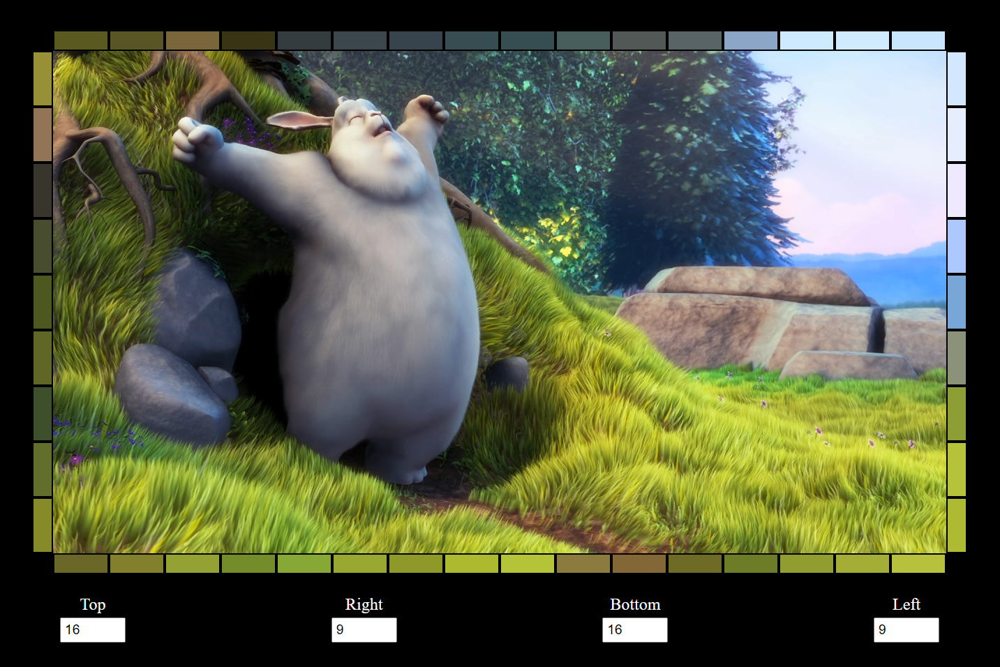

# Reactive Lighting for LED Strip



This project is a web-based application that analyzes video frames and displays the average RGB and luminance values for segments of the video. The segments are represented as rectangles around the edges of the video container.

## Features

- Dynamically create and update rectangle segments based on user input.
- Analyze video frames to calculate the average RGB and luminance values for each segment.
- Display the calculated values by updating the background color of the rectangles.
- Console log the JSON object representing the rectangle segments and their values whenever there is an update.

## How It Works

1. **User Input**: The user can specify the number of segments for the top, right, bottom, and left edges of the video container using input fields.
2. **Rectangle Creation**: Based on the user input, rectangles are dynamically created and positioned around the edges of the video container.
3. **Video Analysis**: When the video is playing, paused, or seeked, the application analyzes the video frames to calculate the average RGB and luminance values for each segment.
4. **Display Values**: The calculated values are used to update the background color of the rectangles.
5. **Logging**: The JSON object representing the rectangle segments and their values is logged to the console whenever there is an update.

## JSON Object Structure

The JSON object representing the rectangle segments is structured as follows:

```json
{
  "1": {
    "id": 1,
    "avgColor": "rgb(255, 0, 0)",
    "avgLuminance": 76.245
  },
  "2": {
    "id": 2,
    "avgColor": "rgb(0, 255, 0)",
    "avgLuminance": 150.45
  },
  ...
}
```
